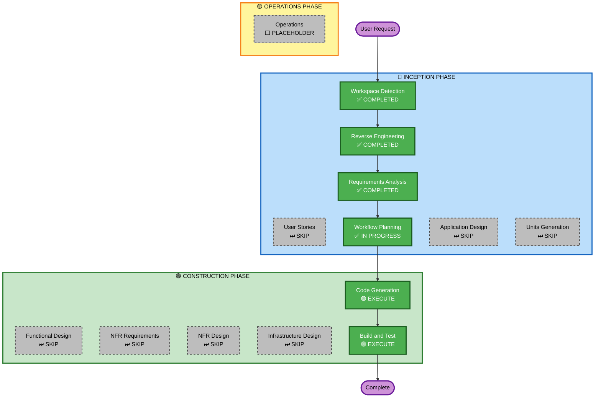

# Execution Plan

## Detailed Analysis Summary

### Transformation Scope
- **Transformation Type**: Single-package removal / refactoring
- **Primary Changes**: Delete domain-specific functionality; rename package; introduce `project.env` config file and `apply-project-config.sh` setup script; rewrite documentation
- **Related Components**: All files in the repository are touched, but there are no external dependencies, no CDK stacks, no microservices — this is a self-contained single-package Python project

### Change Impact Assessment
- **User-facing changes**: No — this is a template for developers, not a deployed application with end-users
- **Structural changes**: Minor — package directory renamed (`transmission_mcp` → `mcp_base`); `project.env` and `apply-project-config.sh` added; `docs/` and all Transmission test files deleted
- **Data model changes**: No — `TransmissionConfig` dataclass removed from `config.py`; no schema or persistence changes
- **API changes**: No — MCP transport (Streamable HTTP on port 8080) is unchanged; `health_check` tool replaces the 7 Transmission tools but the MCP wire protocol is unaffected
- **NFR impact**: No — all existing quality gates (ruff, mypy, pytest, Docker build) are preserved

### Component Relationships
- **Primary Component**: `src/transmission_mcp/` (renamed to `src/mcp_base/`)
- **Dependent on**: `fastmcp>=2.0` (kept), `transmission-rpc` (removed)
- **Consumers**: None — bare template has no external consumers
- **Coordination**: No cross-package coordination needed; all changes are within one repository

### Risk Assessment
- **Risk Level**: Low
- **Rollback Complexity**: Easy — git revert; no database migrations, no deployed infrastructure
- **Testing Complexity**: Simple — unit tests only; quality gates are `ruff format`, `ruff check`, `mypy`, `pytest tests/unit/`

---

## Workflow Visualization

---

## Phases to Execute

### 🔵 INCEPTION PHASE
- [x] Workspace Detection — COMPLETED
- [x] Reverse Engineering — COMPLETED
- [x] Requirements Analysis — COMPLETED
- [ ] User Stories — **SKIP**
  - **Rationale**: Pure removal / refactoring with no user-facing functionality changes; no personas or acceptance criteria needed
- [x] Workflow Planning — IN PROGRESS
- [ ] Application Design — **SKIP**
  - **Rationale**: No new components or services; all changes are within existing component boundaries
- [ ] Units Generation — **SKIP**
  - **Rationale**: Single-package project; changes span multiple file categories but not multiple independent services or modules; the Code Generation plan checklist will organise the work into logical groups

### 🟢 CONSTRUCTION PHASE
- [ ] Functional Design — **SKIP**
  - **Rationale**: Removal project; no new business logic or data models; `health_check` returns a fixed dict — no design required
- [ ] NFR Requirements — **SKIP**
  - **Rationale**: All NFRs are already fully defined in requirements (ruff, mypy, pytest, Docker build); no new NFRs introduced
- [ ] NFR Design — **SKIP**
  - **Rationale**: NFR Requirements phase skipped; nothing to design
- [ ] Infrastructure Design — **SKIP**
  - **Rationale**: Dockerfile unchanged; deployment model unchanged; `publish.yml` change (source `project.env`) is specified precisely in FR-09 with no design ambiguity
- [ ] Code Generation — **EXECUTE** (always)
  - **Rationale**: Implementation required; Part 1 (plan checklist) will group changes into logical sections: removals, Python source, tests, configuration, scripts, documentation, Claude rules
- [ ] Build and Test — **EXECUTE** (always)
  - **Rationale**: Quality gates must pass: `ruff format`, `ruff check`, `mypy src/`, `pytest tests/unit/`, `docker build`

### 🟡 OPERATIONS PHASE
- [ ] Operations — PLACEHOLDER
  - **Rationale**: Future deployment and monitoring workflows; not applicable here

---

## Code Generation Change Groups

The single Code Generation phase will work through these logical groups in order:

| Group | Changes |
|---|---|
| 1. Deletions | `docs/`, `tests/integration/`, `docker-compose.test.yml`, 4 Transmission unit test files |
| 2. Package rename | `src/transmission_mcp/` → `src/mcp_base/`; all internal import references |
| 3. Python source | `server.py`, `tools.py`, `config.py` repurposed per FR-02/FR-03/FR-04 |
| 4. Tests | `tests/unit/test_config.py` stripped of `TransmissionConfig` cases |
| 5. Config & CI | `project.env` created; `pyproject.toml` updated; `config.toml.example` updated; `publish.yml` updated to source `project.env` |
| 6. Setup script | `scripts/apply-project-config.sh` created per FR-13 |
| 7. Documentation | `README.md` rewritten; `repository-overview.md` rewritten; `MAINTAINERS.md` updated |
| 8. Claude rules | `.claude/rules/repository-overview.md` and `readme-docker-compose.md` updated per FR-11; `.claude/rules/apply-project-config.md` created per FR-13 |

---

## Success Criteria
- **Primary Goal**: Fully stripped, functional bare-bones FastMCP server template
- **Key Deliverables**: Renamed Python package with `health_check` placeholder tool; `project.env` + `apply-project-config.sh` customisation workflow; rewritten developer-guide README; updated Claude rules
- **Quality Gates**: `uv run ruff format .` (zero changes), `uv run ruff check .` (zero errors), `uv run mypy src/` (zero errors), `uv run pytest tests/unit/` (all pass), `docker build` (succeeds)
